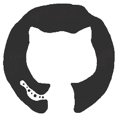

<h1 align="center">Hi, I'm Vadym 👋</h1>

<h3 align="center">C++ Developer from Ukraine 🇺🇦</h3>

  Building Windows tools, automation utilities, and low-level experiments.

  

  
  

---

## 👨‍💻 About me

I'm a self-taught developer focused primarily on **C++ and Windows development**.

I enjoy building practical tools, automating repetitive tasks, and understanding how software works under the hood. My technical interests include modern C++, WinAPI, multithreading, memory management, operating system internals, and reverse engineering.

I'm interested in **junior developer positions, internships, and collaborative projects** where I can gain real-world experience and contribute to useful software.

  

---

## 🛠️ Tech stack

<h3 align="center">Languages</h3>

  
  
  

<h3 align="center">Technologies &amp; concepts</h3>

  
  
  

  
  
  
  

<h3 align="center">Tools and platforms</h3>

  

  

---

  

<h2 align="center">💬 Let's connect</h2>

  Have a project idea or a junior opportunity? Let's talk.

  

  <a href="https://github.com/osFERPHY?tab=repositories">Browse my projects</a>
  &nbsp; · &nbsp;
  <a href="https://t.me/Nvwvvww">Telegram — @Nvwvvww</a>

  <i>Building, understanding, and improving software one project at a time.</i>

